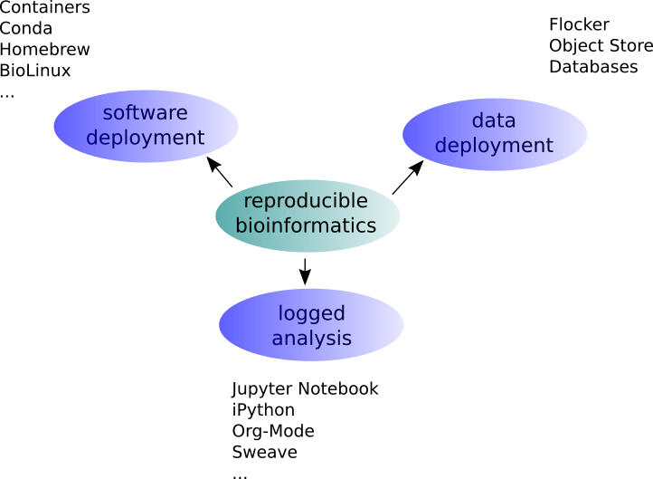
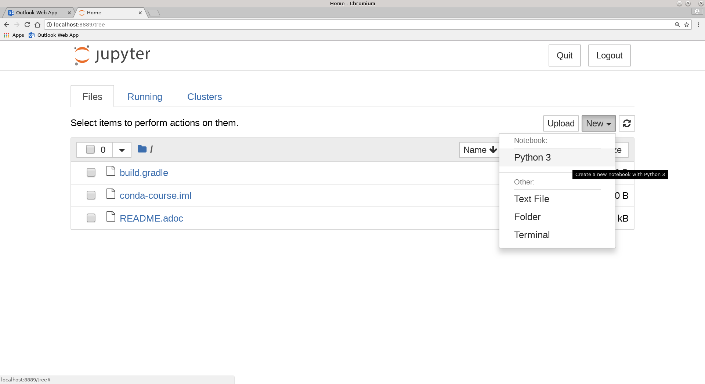
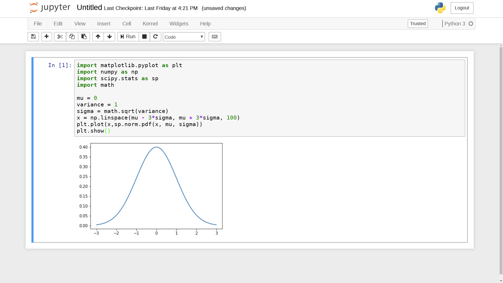

= Conda for Convenience and Reproducibility
Philip R. Kensche
v1.0, 2018-07-19
:doctype: book
:docinfo:


== Bioinformatic Reproducibility



We will focus here on software deployment.

== You want ...

=== ... to publish and share
[plantuml]
....
@startuml
title
Share!
end title

:you:
:other:

top to bottom direction
you <-> other : communicate

node "your system" as yours {
   left to right direction
   you ..> [workflow] : develop
}

node "other system" as others {
   top to bottom direction
   [workflow] -> [workflow ] : transfer

   left to right direction
   other ..> [workflow ] : execute
}

@enduml
....

=== .. to reuse
[plantuml]
....
@startuml
title
Reuse!
end title

:you:
:future you!: as future

top to bottom direction
you -> future : communicate

node "old system" as old {
   left to right direction
   you ..> [workflow] : develop
}

node "new system" as new {
   top to bottom direction
   [workflow] -> [workflow ] : transfer

   left to right direction
   future ..> [workflow ] : reuse
}


@enduml
....

<<<
=== ... to scale out
[plantuml]
....
@startuml
title
Cloud!
end title

:you:

cloud "de.NBI Cloud" {
   node "Node 1000" as n1000
   node "Node 1" as n1
   node "Node 2" as n2

   node n1 {
     [workflow]
     left to right direction
     you ...> [workflow]
   }

   node n2 {
     [workflow  ]
     left to right direction
     you ...> [workflow  ]
   }

   node n1000 {
     [workflow ]
     left to right direction
     you ...> [workflow ]
   }


}

@enduml
....

== The Challenges ...

  * Many software tools in specific versions.
  * Pre-installed "department software stack".
  * Where to download the correct versions and how to compile them?

=== Software Deployment

There are uncontrollable factors:

* Software on the host operating system evolves
* Bioinformatic software packages may get lost
* You don't want to waste you time with this technical stuff
  - ... there are also the other reproducibility aspects
  - ... and the publishing ...

NOTE: Implement reproducibility features as early as possible!

== Requirements

* Quick and correct software deployment
* Simple user-space installation without administrator rights
* Manage multiple independent tool sets
* Lots of packages ... maintained by s.b. else ;-D
* Easy sharing of workflows
* Possible to publish of *your* tools

=== Enter https://conda.io/docs/[Conda]

* https://www.anaconda.com/[Anaconda Inc.] (https://github.com/ContinuumIO[Continuum Analytics Inc.])
* Command-line tool based on Python (2.7, 3.6)
* Anaconda and https://conda.io/miniconda.html[Miniconda] distributions
* For Linux > 9000 packages, > 86.000 versions (including those for bioinformatics)
  - Linux
  - MacOS
  - Windows

=== ... and https://bioconda.github.io/[BioConda]

* Community-driven package repository (channel)
 - > 4.000 bioinformatic-related packages, > 18.000 versions
 - BioConda https://github.com/bioconda/bioconda-recipes[Recipes]
 - Most packages available for Linux

== Using Conda

=== Install Miniconda

[source,bash]
----
$ wget https://repo.continuum.io/miniconda/Miniconda3-latest-Linux-x86_64.sh
$ bash Miniconda3-latest-Linux-x86_64.sh
----

WARNING: Choose a place where you have a enough free space. Environments are (by default) also installed there and each can take up 100s of megabytes.

Now start conda and get some information about the interface:

[source,bash]
----
$ conda
usage: conda [-h] [-V] command ...

conda is a tool for managing and deploying applications, environments and packages.

Options:

positional arguments:
  command
    info         Display information about current conda install.
    help         Displays a list of available conda commands and their help
                 strings.
    list         List linked packages in a conda environment.
    search       ...
    create       ...
    install      ...
...
----

\... and the basic configuration information:

```bash
$ conda info
Current conda install:

               platform : linux-64
          conda version : 4.3.21
       conda is private : False
      conda-env version : 4.3.21
    conda-build version : not installed
         python version : 3.6.1.final.0
       requests version : 2.14.2
       root environment : /path/to/your/miniconda3  (writable)
    default environment : /path/to/your/miniconda3
       envs directories : /path/to/your/miniconda3/envs
                          /path/to/your/.conda/envs
          package cache : /path/to/your/miniconda3/pkgs
                          /path/to/your/.conda/pkgs
           channel URLs : https://repo.continuum.io/pkgs/free/linux-64
                          https://repo.continuum.io/pkgs/free/noarch
                          https://repo.continuum.io/pkgs/r/linux-64
                          https://repo.continuum.io/pkgs/r/noarch
                          https://repo.continuum.io/pkgs/pro/linux-64
                          https://repo.continuum.io/pkgs/pro/noarch
                          https://conda.anaconda.org/r/linux-64
                          https://conda.anaconda.org/r/noarch
            config file : /path/to/your/.condarc
             netrc file : None
           offline mode : False
             user-agent : conda/4.3.21 requests/2.14.2 CPython/3.6.1 Linux/3.10.0-514.el7.x86_64 CentOS Linux/7.3.1611 glibc/2.17
                UID:GID : 21917:1110

```

=== Channels

* Channels are conda's package repositories
* Multiple channels can be used at the same time with different priorities

[source,bash]
----
$ conda config --add channels defaults     <1>
$ conda config --add channels conda-forge
$ conda config --add channels bioconda
----
<1>  Ananconda Inc.'s default channels

Each command adds a channel with higher priority than the previous commands.

Now the output of ...

[source,bash]
----
$ conda info
...
           channel URLs : https://conda.anaconda.org/bioconda/linux-64    <1>
                          https://conda.anaconda.org/bioconda/noarch      <1>
                          https://conda.anaconda.org/conda-forge/linux-64 <1>
                          https://conda.anaconda.org/conda-forge/noarch   <1>
                          https://repo.continuum.io/pkgs/free/linux-64
                          https://repo.continuum.io/pkgs/free/noarch
                          https://repo.continuum.io/pkgs/r/linux-64
                          https://repo.continuum.io/pkgs/r/noarch
                          https://repo.continuum.io/pkgs/pro/linux-64
                          https://repo.continuum.io/pkgs/pro/noarch
                          https://conda.anaconda.org/r/linux-64
                          https://conda.anaconda.org/r/noarch
...
----
<1> \... will show the updated channel list with the "bioconda" and "conda-forge channels.


=== Finding Packages

[source,bash]
----
$ conda search -h
usage: conda search [-h] [-n ENVIRONMENT | -p PATH] [-i] [-C]
                    [--platform PLATFORM] [--reverse-dependency] [--offline]
                    [-c CHANNEL] [--override-channels] [--json] [--debug]
                    [--verbose] [--use-local] [-k] [--envs]
...

$ conda search samtools
Loading channels: done
# Name                  Version           Build  Channel
samtools                 0.1.12               0  bioconda
samtools                 0.1.12               1  bioconda
samtools                 0.1.12               2  bioconda
...
samtools                 0.1.19               0  bioconda
samtools                 0.1.19               1  bioconda
samtools                 0.1.19               2  bioconda
samtools                 0.1.19               3  bioconda
samtools                    1.0               0  bioconda
samtools                    1.0               1  bioconda
samtools                    1.0      hdd8ed8b_2  bioconda
samtools                    1.1               0  bioconda
...
samtools                    1.8               2  bioconda
samtools                    1.8               3  bioconda
samtools                    1.8               4  bioconda
samtools                    1.8      h46bd0b3_5  bioconda
----

First, you'll notice that a search can take some time!

The output shows which package versions match the search expression and are available from which channel in which version.

Note that the build version sometimes is pretty simple, but sometimes rather cryptic. Build versions represent the same package but with changed

  * compile parameters
  * dependencies (numpy, ...)
  * interpreters (Perl, Python, R, ...)
  * commit hashes (where you can hope they produce the same results)

You can also search for specific package versions and builds:

[source,bash]
----
$ conda search samtools==0.1.19
Loading channels: done
# Name                  Version           Build  Channel
samtools                 0.1.19               0  bioconda
samtools                 0.1.19               1  bioconda
samtools                 0.1.19               2  bioconda
samtools                 0.1.19               3  bioconda

$ conda search '*samtools'       <1>
Loading channels: done
# Name                  Version           Build  Channel
bioconductor-rsamtools          1.22.0        r3.2.2_0  bioconda
bioconductor-rsamtools          1.22.0        r3.2.2_1  bioconda
bioconductor-rsamtools          1.24.0        r3.3.1_0  bioconda
bioconductor-rsamtools          1.26.1        r3.3.1_0  bioconda
bioconductor-rsamtools          1.26.1        r3.3.2_0  bioconda
bioconductor-rsamtools          1.26.1        r3.4.1_0  bioconda
bioconductor-rsamtools          1.28.0        r3.4.1_0  bioconda
bioconductor-rsamtools          1.30.0        r3.4.1_0  bioconda
perl-bio-samtools                 1.43               0  bioconda
samtools                        0.1.12               0  bioconda
samtools                        0.1.12               1  bioconda
...
----
<1> the quotes prevent globing the asterisk by the shell

TIP: Check the Conda documentation on https://conda.io/docs/user-guide/tasks/build-packages/package-spec.html[package specification] for a description of the match pattern if you need to do complex searches.


=== Environments

Environments allow you to handle different -- potentially incompatible -- sets of tools.

To list all available environments you can do:

[source,bash]
----
$ conda list                 <1>
# conda environments:
#
base                  *  /data/kensche/work/share/miniconda3
----
<1> An equivalent command is `conda info --envs`

Let's create a new environment with another great tool for reproducible research:

[source,bash]
----
conda create -n interactive-analysis jupyter-notebook scipy
----

First this shows you which exact versions and builds will be installed. For a single tool a large number of dependencies may be pulled in. This request will install about 125 MB of tools! Many of them are likely not used or needed by you.

After you confirmed that the installation is o.k. the packages will get downloaded. When finished you can see the "interactive-analysis" in the list of your environments.

[source,bash]
----
$ conda env list
# conda environments:
#
base                  *  /path/to/your/miniconda3
interactive-analysis     /path/to/your/miniconda3/envs/interactive-analysis
----

Let's first try

[source,bash]
----
$ jupyter
bash: jupyter: Command not found
----

That's probably the obvious outcome of this negative control experiment :-P

Now switch to the newly installed environment and try out you new toy:

[source,bash]
----
$ source activate interactive-analysis
$ jupyter notebook
----

Jupyter notebook will show a URL on the standard output and open it in a browser. You can then start a "Python 3 kernel" at the top right in the bar ...



\... and then enter arbitary Python 3 expressions, such as



==== Oops!

Actually, in my case when starting the Python kernel in Jupyter, I got an error message. Apparently, the specific version of the Jupyter package was broken!

This is not only a demonstration of the daily life in bioinformatics but also the ideal opportunity to demonstrate that you can install arbitrary Python packages in this environment using the `pip` tool. So after ...

[source,bash]
----
$ pip install jupyter -U
----

\... an up-to-date Jupyter Notebook package is installed in the environment!

=== Leaving Environments

After you are done with your work, you can do ...

[source,bash]
----
$ source deactivate
----

\... to restore you original, Conda-free environment.

=== Sharing Environments

How to transfer an environment to a different machine?

1. Export the environment specification into a YAML file.
+
```bash
$ conda env export -n interactive-analysis > environment.yaml
```
+
The resulting YAML file looks like this:
+
[source,yaml]
----
name: interactive-analysis
channels:
  - defaults
  - r
  - bioconda
  - conda-forge
dependencies:
  - bleach=1.4.2=py36_0
  - ca-certificates=2017.11.5=0
  - certifi=2017.11.5=py36_0
  - dbus=1.10.22=0
  - samtools=4.1.2=py36_0
  ...
prefix: /path/to/your/miniconda3/envs/interactive-analysis
----
+
The `prefix` line shows a local path and is non-essential. It can be removed when publishing.

2. Copy the file to the target machine.

3. Create a new environment using the file. We just make a local copy for demonstration, but you could equally execute this on a different system.
+
[source,bash]
----
$ conda env create -n interactive-analysis-copy -f environment.yaml
----

After this on the other system you can normally `source activate` the new environment.


=== Removing Environments

Let's remove the copy of the "interactive-analysis" environment we just created:

[source,bash]
----
$ conda env list
# conda environments:
#
base                       /path/to/your/miniconda3
interactive-analysis       /path/to/your/miniconda3/envs/interactive-analysis
interactive-analysis-copy  /path/to/your/miniconda3/envs/interactive-analysis-copy

$ conda env remove -n interactive-analysis-copy

$ conda env list
# conda environments:
#
base                       /path/to/your/miniconda3
interactive-analysis       /path/to/your/miniconda3/envs/interactive-analysis
----

=== Renaming Environments

There is no dedicated renaming command. Instead, renaming an environment is done by "cloning" it and removing the original:

[source,bash]
----
$ conda create --clone interactive-analysis -n my-nature-publication
$ conda remove -n interactive-analysis
$ conda env list
# conda environments:
#
base                       /path/to/your/miniconda3
my-nature-publication      /path/to/your/miniconda3/envs/my-nature-publication
----

== Limitations

Conda is easy to install and use, but also has its limitations.

  * Of each package only a single version can be installed.
  * `conda install` can be slow or may even not terminate.
  * `conda install` may fail to find non-conflicting package versions.
  * Dependencies in the "build recipes" can be too narrow or too wide.
  * Contributing can be hard
    - Different channels provide different tooling for contributing packages ("continuous integration").
  * *Packages can get lost!* (So far for reproducibility!)

=== Package Loss?

  * Complete rebuild of channels
    * May result in updated build dependencies (Perl, R, Python)
  * Packages get moved between channels (e.g. Bioconda <-> Conda Forge)
    * May result in updated build dependencies (Perl, R, Python)
  * Packages get completely removed

How to cope with these problems?

==== "bioconda-legacy" Channel

*Some* outdated packages can still be present there.

Add the channel to your channel list with

[source,bash]
----
$ conda config --add channels bioconda-legacy
----

==== Upgrade to newer R, Perl, Python

It may be safe to upgrade to larger versions of R, Perl, Python, as long as the bioinformatic packages remain at the same version.

To achieve this you need to remove version constraints from the exported environemnt YAML file and let Conda find a suited package version:

[source,yaml]
----
name: interactive-analysis
channels:
  - defaults
  - r
  - bioconda
  - conda-forge
dependencies:
  - ca-certificates             <1>
  - r-base=3.3.*                <2>
  - r-lattice=0.20_34           <3>
  ...
----
<1> Complete version removed. Package has little influence on the analysis.
<2> Changed from "=r3.3.2=5".
<3> Left out the R version "=r3.3.2_0". Package is highly stable since before R 2.0.

==== Other Solutions

  * Build a local version of the package with `conda build`
  * Keep a local channel copy?
  * Use containers or virtual machines to avoid having to reinstall the Conda environment

== Summary

  * Conda has probably the largest community of bioinformatic package contributors.
  * Conda makes it easy and fast to set up environments.
  * You can contribute recipes for packages you need or your own packages.
  * Conda can well be combined with container technology, like https://singularity.lbl.gov/[Singularity] or https://www.docker.com/[Docker]
     - at the cost of additional complexity
     * BioConda has automatic building of Docker and Singularity containers via https://conda.io/docs/[BioContainers]


TIP: Implement reproducibility features as early as possible!

== Some References

* Conda User's Guide @ https://conda.io/docs/user-guide
* BioConda article @ https://www.nature.com/articles/s41592-018-0046-7
