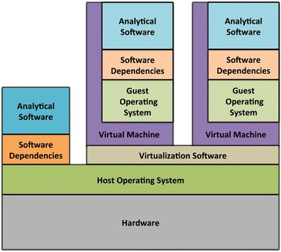
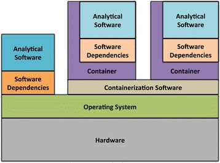

= Script: Reproducibility in Bioinformatics
Philip R. Kensche & Michael Heinold
v2.0, 2019-03-06
:doctype: book
:docinfo:

* HTML 5 Document:   https://dkfz-odcf.github.io/bioinformatic-reproducibility-course
* Github Repository: https://github.com/DKFZ-ODCF/bioinformatic-reproducibility-course

== Definition "Reproducibility"

Modified after Wikipedia:

  Closeness of the agreement between different measurements of the same measurand using the same methodology.

* E.g. in-experiment reproducibility quantified as standard deviation

* Measurements at various scales of mathematical derivation
** "Raw" data is produced by the sensor hardware
** Derived measurements are used to interpret the results

* "... using the same methodology."
** All numbers must be described such that ...
*** ... they can be interpreted
*** ... they can be reproduced [exactly] from the same raw data

NOTE: Reproducibility ensures refutability based on methodological reasons!

== Limits of Reproducibility

* Wet-lab: possible but never exact
* _In silico_: exact reproducibility seems possible but
** Limited by data biases and noise
** Limited by computer hardware
* At some point further investment to reproduce results is futile!

== Overview

image::reproducibility.png[Reproducibility,width=500]

== A Bioinformaticians Toolshed

* Bioinformatic Research Workflow
* Workflow Management Systems
* Notes on Programming
* Version Control
* Software Deployment, Containers & Virtualiziation
* Literate Programming

=== A Bioinformatics Research Workflow

==== Prototyping

* Quick & leaky (& correct)
* Aim: Learn about the general problems of the question
* Throw away!
* Often done in interactive sessions

==== Exploration

* Made to last
* Log analysis, decisions, interpretations
* Log errors, failure, conclusions & steps towards the correct solution
* Not meant to share

==== Reconciliation

* Based on canonical set of intermediate results
* High certainty and consistency
* Arranged by interpretation & reasoning
* Sufficient to communicate to cooperation partners

==== Publication

* Very high certainty
* Highly tuned towards presentation
* Selected after reconciliation
* Publishable document

=== Workflow Management Systems

  * "workflow" = program

  * Workflow Management Systems
    - Syntax for defining workflows
    - Abstract from execution backends (e.g. different batch processing systems)
    - Manage dependencies between data and processing steps
    - Log execution to ease reproduction

==== No Standards

  * Literally https://github.com/common-workflow-language/common-workflow-language/wiki/Existing-Workflow-systems[hundreds] of systems
  * but ...
    - https://galaxyproject.org/use/[Galaxy]
    - https://bitbucket.org/snakemake/snakemake[Snakemake] (Python)
    - https://www.nextflow.io/[Nextflow] (Groovy)
    - https://www.commonwl.org/[CWL]
    - WDL (https://github.com/broadinstitute/cromwell[Cromwell])
  * Choice usually driven by taste and peers

=== Notes on Programming

==== What is programming?

* Examples
** Writing a workflow
** Composing a workflow in Galaxy
** Plotting something in R
** Logging in to a computer checks s.th. on the shell

==== Programming as Communication

  * Computer must understand your code
  * Your *future you* must understand your code
  * Others must understand your code, because you have to
  ** leave the lab
  ** explain your approach
  ** publish the code

==== Programming as Complexity Management

  * Biological systems are complex
  * Bioinformatic code to analyze biological systems is complex
  * Complexity increases while you add analyses to your project

NOTE: Code is living. It changes while you fix bugs and extend it. And it can grow into a monster!

==== Programming Languages

  * Every programming language has its strengths and weaknesses

===== R

[cols="1a, 1a", options=header]
|===
| Pro
| Con

| * Statistics
  * Exploratory data analysis
  * Data plotting

| * Text processing
  * Large datasets (because of memory management)
  * Parallel processing
|===


===== Bash

  * Frequently default shell on Linux environments

[cols="1a, 1a", options=header]
|===
| Pro
| Con

| * Doing quick checks of files
  * Top-level automatization of multiple tools into *simple* workflows
  * Plugging together (few) components

| * Working with complex data
  * Workflows with more than 2-3 steps and branchings
  * Handling errors (they will happen!)
|===

===== Python, Perl, Ruby or other Scripting Languages

* Scripting languages are not "compiled" into binaries (assembly language)

[cols="1a, 1a", options=header]
|===
| Pro
| Con

| * Serious programming
  * Handling complex data
  * Get going quickly both for learning and analyzing

| * Really fast processing (except numerics or text)
  * Very complex programs
  * More aspects of program correctness need to be checked by programmer
  ** through tests and assertions
|===

===== Compiled Languages

[cols="1a, 1a", options=header]
|===
| Pro
| Con

| * Very complex programs
  * Tuning towards super-fast applications
  * Support you by advanced (static) checking of data types

| * Additional hurdles for learning
  * Get going quickly
|===

==== Programming Power Tools

  * Code review
  * Ask a software developer
  * Use an integrated development environment [IDE] (PyCharm, IntelliJ IDEA, ...)
  * Automated tests
  ** Ensure your program remains correct
  ** Unit testing frameworks
  ** Even in Bash [shunit2]
  * Use a version control system

=== Version Control Systems

  * Manage many versions of your [living] code
  * Code is usually is some form of text and stored in a "repository" (some form of "database")
  ** Programming language code (Python, Perl, R, etc.)
  ** Workflow descriptions
  ** Documentation
  * Diverse tools
  ** SNV, CVS, Mercurial, **Git**, ...


==== Terminology for Git

image::github-flow-branching-model-0606fb12b7a55784a3b52833fd015ebd-e0740.png[TheGitHubflow,width=500]

  * Registering code as version valuable enough to track is called "committing"
  * Every commit is associated with a number (the "hash")
  * Parallel development lines are tracked in "branches"
  * The active code base on filesystem is the "checked out" branch (plus uncommitted changes)
  * Main development line is the "master branch"
  * Fixed versions can be marked with a tag

==== How to use?

  * Good and simple guidelines to track development code are:
    - https://guides.github.com/introduction/flow/[GitHub Flow]
    - https://www.nicoespeon.com/en/2013/08/which-git-workflow-for-my-project/[Which git workflow for my project?]
    - http://mateuszmistecki.pl/2017/03/27/github-flow/[Another GitHub Flow page]
  * Git Book @ https://git-scm.com/book/en/v2
  * Consider using a Git GUI (NOTE: Code is living[here] a list) or an IDE that knows Git
  * https://guides.github.com/introduction/flow/[Happy Git and Github for useR]
//  * Track your data versions with https://git-lfs.github.com/[git-lfs]

==== One Step Further

  * Link data to repository state
  * Ensure your repo is clean
  * Put your commit hash into figures and files
  * Git-bindings available for all programming languages

NOTE: Tracking code versions is often not enough. Consider using https://git-lfs.github.com/[git-lfs].

===== R Example with https://github.com/ropensci/git2r[git2r]

[source,r]
----
> library("git2r") # <1>
> repo <- repository("/path/to/your/repo/dir") # <2>
> is_dirty <- function(status) {
    length(status$staged) != 0 ||
      length(status$unstaged) != 0 ||
        length(status$untracked) != 0 # <3>
}
> if (is_dirty(status(repo))) { stop("Not proceeding! Repo is dirty!"); } # <4>
> commitHash <- sha(head(repo)) # <5>
----

<1> Load the R library for accessing git repositories
<2> Get a handle for the repository
<3> Simple (!) definition of "dirty": there are uncommitted changes or files
<4> Check that the repository is clean, i.e. all changes are committed
<5> Get the unique identifier of the current repository commit

===== Python Example with https://gitpython.readthedocs.io/en/stable/intro.html[gitpython]

[source,python]
---
> from git import * # <1>
> repo = Repo("/path/to/your/repo/dir") # <2>
> if (repo.is_dirty()): raise Exception("Not proceeding! Repo is dirty!") # <3>
> commitHash = repo.head.commit.__str__() # <4>
---

<1> Load the Python library for accessing git repositories
<2> Get a handle for the repository
<3> Check that the repository is clean, i.e. all changes are committed
<4> Get the unique identifier of the current repository commit

===== One more advise

Please note, that the above examples only check your LOCAL repository. Thus said, it is not necessarily true, that the
hash code you get is available to everyone. If you want to make sure that you don't only refer to a local hash / copy
you could also check, if the hash code is available in at least one remote repository (In terms of git, this is the
origin repository by default).

=== Software deployment ...

==== ... to publish and share

[plantuml]
....
@startuml
title
Share!
end title

:you:
:other:

top to bottom direction
you <-> other : communicate

node "your system" as yours {
   left to right direction
   you ..> [workflow] : develop
}

node "other system" as others {
   top to bottom direction
   [workflow] -> [workflow ] : transfer

   left to right direction
   other ..> [workflow ] : execute
}

@enduml
....

==== .. to reuse
[plantuml]
....
@startuml
title
Reuse!
end title

:you:
:future you!: as future

top to bottom direction
you -> future : communicate

node "old system" as old {
   left to right direction
   you ..> [workflow] : develop
}

node "new system" as new {
   top to bottom direction
   [workflow] -> [workflow ] : transfer

   left to right direction
   future ..> [workflow ] : reuse
}


@enduml
....

<<<
==== ... to scale out
[plantuml]
....
@startuml
title
Cloud!
end title

:you:

cloud "de.NBI Cloud" {
   node "Node 1000" as n1000
   node "Node 1" as n1
   node "Node 2" as n2

   node n1 {
     [workflow]
     left to right direction
     you ...> [workflow]
   }

   node n2 {
     [workflow  ]
     left to right direction
     you ...> [workflow  ]
   }

   node n1000 {
     [workflow ]
     left to right direction
     you ...> [workflow ]
   }


}

@enduml
....

==== The Challenges

* Lots of software tools! Lots of versions!
* Windows, Mac, dozens of Linux distributions, in different versions ...
* Bioinformatic software packages may get lost
* Do this 1000 times?
* Boring technical stuff

==== Packaging System Requirements

* Quick, easy & correct software deployment
* Simple user-space installation without administrator rights
* Manage multiple independent tool sets
* Lots of packages ... maintained by s.b. else ;-D
* Easy sharing
* Possible to publish *your* tools

==== Enter the realm of https://conda.io/docs/[Conda]

* Open source software by https://www.anaconda.com/[Anaconda Inc.] (https://github.com/ContinuumIO[Continuum Analytics Inc.])
* Command-line tool based on Python (2.7, 3.6)
* Anaconda and https://conda.io/miniconda.html[Miniconda] distributions
* For Linux > 9000 packages, > 86.000 versions (including those for bioinformatics; June 2018)
  - Linux
  - MacOS
  - Windows

==== ... and dive into https://bioconda.github.io/[BioConda]

* Community-driven package repository (channel)
 - > 4.000 bioinformatics related packages, > 18.000 versions
 - BioConda https://github.com/bioconda/bioconda-recipes[Recipes]
 - Most packages available for Linux

==== Final Remarks on Conda

* Tons of tutorials online
** One at the end of this document
* Long-term package availability is not 100%
** Use "Bioconda" together with "bioconda-legacy" channel
** Backup the `pkgs/` directory in your Conda installation!

=== Virtualization & Containers

* Why?
** You need to scale out to thousands of compute hours
** Collaboration partners force you to

====  Virtual Machines (VMs)

  * Complete isolation of analysis environment
  * Virtualization software (e.g. also for your desktop)
  ** https://www.qemu.org/[KVM/QEMU], https://www.virtualbox.org/[VirtualBox], https://www.vmware.com/[VMWare]
+


==== Containers

  * Use host-operating system (kernel)
  * All software and libraries are installed in the container
  * Container technologies
  ** https://www.docker.com/[Docker]
  ** https://singularity.lbl.gov/[Singularity]
  ** https://coreos.com/rkt/docs/latest/[Rkt]
+


==== Cloud

  * Usually VMs
  * Simplified handling of multiple VMs
  ** start/stop VMs as you need them
  ** pay only what you need
  ** additional advanced infrastructure at you fingertips
  *** Large filesystems on demand
  *** Object Store
  *** GPUs
  * Many cloud management systems
  ** Commercial
  *** Google Cloud, Amazon Web Services, Microsoft Azure, ...
  ** https://www.openstack.org/[OpenStack]
  *** Frequently used in science (e.g. https://www.denbi.de/cloud[de.NBI Cloud])
  * You need administration knowledge
  ** Tools that help you
  *** https://github.com/gc3-uzh-ch/elasticluster[ElastiCluster], https://github.com/BiBiServ/bibigrid[BiBiGrid]

IMPORTANT: If you deal with patient related data, public cloud services can be problematic regarding data protection and safety!

=== Literate Programming

* Keep code and documentation together
** Analysis code
** Exploratory data analyses
** Data analysis results and interpretations
** Decision log

==== Jupyter Notebook

* Web-server
** Easy installation _via_ Conda
** Can run on a large server
** Can be started with a single command:
+
 jupyter notebook

* Various backends (called "kernels")
** Bash, Python, R, Spark
* Integrated display code, figures & documentation:
+
image::Jupyter2.png[Plot]

* Notebooks can be saved and shared

== Summary

* Aspects of reproducible bioinformatics (incomplete :-) )
** Development
*** Programming
*** Workflow management systems
** Execution
*** Changing computational environments
*** Migration
** Logging
*** Versioning
*** Literate programming

== Further Material

* Courses PM7 and AM4 at the ISMB/ECCB 2019 in Basel @ https://www.iscb.org/ismbeccb2019-program/tutorials
* Conda User's Guide @ https://conda.io/docs/user-guide
* BioConda article @ https://www.nature.com/articles/s41592-018-0046-7
* NBIS Reproducible Science Course @ https://nbis-reproducible-research.readthedocs.io/en/latest/
* Source code revisioning with https://git-scm.com/[Git]
  - Git Book @ https://git-scm.com/book/en/v2
  - Github Flow @ https://guides.github.com/introduction/flow/
* https://reproduciblescience.org/directory[reproduciblescience.org]
* Miniconda @ https://conda.io/miniconda.html
* BioConda Recipes @ https://github.com/bioconda/bioconda-recipes
* de.NBI Cloud @ https://www.denbi.de/cloud

== References

* Container & virtualization images by +
  Piccolo & Framton, Tools and techniques for computational reproducibility, GigaScience, Volume 5, Issue 1, 1 December 2016, https://dx.doi.org/10.1186%2Fs13742-016-0135-4[s13742-016-0135-4], under http://creativecommons.org/licenses/by/4.0/[Creative Commons Attribution 4.0 International License]
* GitFlow image from https://www.nicoespeon.com/en/2013/08/which-git-workflow-for-my-project[Nicolas Carlo, 2013]

== Tutorial

=== Conda

==== Install Miniconda

[source,bash]
----
$ wget https://repo.continuum.io/miniconda/Miniconda3-latest-Linux-x86_64.sh <1>
$ bash Miniconda3-latest-Linux-x86_64.sh
$ source $HOME/.bashrc
----
<1> alternatively take `curl https://repo.continuum.io/miniconda/Miniconda3-latest-Linux-x86_64.sh -o Miniconda3-latest-Linux-x86_64.sh` or just your browser.

WARNING: Choose a place where you have a enough free space. Environments are (by default) also installed there and each can take up 100s of megabytes. E.g. use `df -h` to get information about free space.

Now start conda and get some information about the interface:

[source,bash]
----
$ conda
usage: conda [-h] [-V] command ...

conda is a tool for managing and deploying applications, environments and packages.

Options:

positional arguments:
  command
    info         Display information about current conda install.
    help         Displays a list of available conda commands and their help
                 strings.
    list         List linked packages in a conda environment.
    search       ...
    create       ...
    install      ...
...
----

\... and the basic configuration information:

```bash
$ conda info
Current conda install:

               platform : linux-64
          conda version : 4.3.21
       conda is private : False
      conda-env version : 4.3.21
    conda-build version : not installed
         python version : 3.6.1.final.0
       requests version : 2.14.2
       root environment : /path/to/your/miniconda3  (writable)
    default environment : /path/to/your/miniconda3
       envs directories : /path/to/your/miniconda3/envs
                          /path/to/your/.conda/envs
          package cache : /path/to/your/miniconda3/pkgs
                          /path/to/your/.conda/pkgs
           channel URLs : https://repo.continuum.io/pkgs/free/linux-64
                          https://repo.continuum.io/pkgs/free/noarch
                          https://repo.continuum.io/pkgs/r/linux-64
                          https://repo.continuum.io/pkgs/r/noarch
                          https://repo.continuum.io/pkgs/pro/linux-64
                          https://repo.continuum.io/pkgs/pro/noarch
                          https://conda.anaconda.org/r/linux-64
                          https://conda.anaconda.org/r/noarch
            config file : /path/to/your/.condarc
             netrc file : None
           offline mode : False
             user-agent : conda/4.3.21 requests/2.14.2 CPython/3.6.1 Linux/3.10.0-514.el7.x86_64 CentOS Linux/7.3.1611 glibc/2.17
                UID:GID : 21917:1110

```

==== Channels

* Channels are conda's package repositories
* Multiple channels can be used at the same time with different priorities

[source,bash]
----
$ conda config --add channels defaults     <1>
$ conda config --add channels conda-forge
$ conda config --add channels bioconda
$ conda config --add channels bioconda-legacy <2>
----
<1> Ananconda Inc.'s default channels
<2> Packages removed from bioconda

Each command adds a channel with higher priority than the previous commands.

Now the output of ...

[source,bash]
----
$ conda info
...
           channel URLs : https://conda.anaconda.org/bioconda-legacy/linux-64  <1>
                                      htttps://conda.anaconda.org/bioconda-legacy/noarch   <1>
                                      https://conda.anaconda.org/bioconda/linux-64                <1>
                                      https://conda.anaconda.org/bioconda/noarch                  <1>
                                      https://conda.anaconda.org/conda-forge/linux-64           <1>
                                      https://conda.anaconda.org/conda-forge/noarch             <1>
                                      https://repo.continuum.io/pkgs/free/linux-64
                                      https://repo.continuum.io/pkgs/free/noarch
                                      https://repo.continuum.io/pkgs/r/linux-64
                                      https://repo.continuum.io/pkgs/r/noarch
                                      https://repo.continuum.io/pkgs/pro/linux-64
                                      https://repo.continuum.io/pkgs/pro/noarch
                                      https://conda.anaconda.org/r/linux-64
                                      https://conda.anaconda.org/r/noarch
...
----
<1> \... will show the updated channel list with the "bioconda-legacy", "bioconda" and "conda-forge channels.


==== Finding Packages
[source,bash]
----
$ conda search -h
usage: conda search [-h] [-n ENVIRONMENT | -p PATH] [-i] [-C]
                    [--platform PLATFORM] [--reverse-dependency] [--offline]
                    [-c CHANNEL] [--override-channels] [--json] [--debug]
                    [--verbose] [--use-local] [-k] [--envs]
...

$ conda search samtools
Loading channels: done
# Name                  Version           Build  Channel
samtools                 0.1.12               0  bioconda
samtools                 0.1.12               1  bioconda
samtools                 0.1.12               2  bioconda
...
samtools                 0.1.19               0  bioconda
samtools                 0.1.19               1  bioconda
samtools                 0.1.19               2  bioconda
samtools                 0.1.19               3  bioconda
samtools                    1.0               0  bioconda
samtools                    1.0               1  bioconda
samtools                    1.0      hdd8ed8b_2  bioconda
samtools                    1.1               0  bioconda
...
samtools                    1.8               2  bioconda
samtools                    1.8               3  bioconda
samtools                    1.8               4  bioconda
samtools                    1.8      h46bd0b3_5  bioconda
----

First, you'll notice that a search can take some time!

The output shows which package versions match the search expression and are available from which channel in which version.

Note that the build version sometimes is pretty simple, but sometimes rather cryptic. Build versions represent the same package but with changed

  * Compile parameters
  * Dependencies (numpy, ...)
  * Interpreters (Perl, Python, R, ...)
  * Commit hashes (where you can hope they produce the same results)
    - Commit hashes are identifiers given to individually tracked versions of a software
    - No officially released versions

You can also search for specific package versions and builds:

[source,bash]
----
$ conda search samtools==0.1.19  <1>
Loading channels: done
# Name                  Version           Build  Channel
samtools                 0.1.19               0  bioconda
samtools                 0.1.19               1  bioconda
samtools                 0.1.19               2  bioconda
samtools                 0.1.19               3  bioconda

$ conda search '*samtools'       <2>
Loading channels: done
# Name                  Version           Build  Channel
bioconductor-rsamtools          1.22.0        r3.2.2_0  bioconda
bioconductor-rsamtools          1.22.0        r3.2.2_1  bioconda
bioconductor-rsamtools          1.24.0        r3.3.1_0  bioconda
bioconductor-rsamtools          1.26.1        r3.3.1_0  bioconda
bioconductor-rsamtools          1.26.1        r3.3.2_0  bioconda
bioconductor-rsamtools          1.26.1        r3.4.1_0  bioconda
bioconductor-rsamtools          1.28.0        r3.4.1_0  bioconda
bioconductor-rsamtools          1.30.0        r3.4.1_0  bioconda
perl-bio-samtools                 1.43               0  bioconda
samtools                        0.1.12               0  bioconda
samtools                        0.1.12               1  bioconda
...
----
<1> You can also try `conda search 'samtools>=1'`.
<2> The quotes prevent globing the asterisk by the shell.

TIP: Check the Conda documentation on https://conda.io/docs/user-guide/tasks/build-packages/package-spec.html[package specification] for a description of the match pattern if you need to do complex searches.


==== Environments

Environments allow you to handle different -- potentially incompatible -- sets of tools.

To list all available environments you can do:

[source,bash]
----
$ conda list                 <1>
# conda environments:
#
base                  *  /path/to/your/miniconda3
----
<1> An equivalent command is `conda info --envs`

Let's create a new environment with another great tool for reproducible research:

[source,bash]
----
$ conda create -n interactive-analysis jupyter-notebook scipy
----

First this shows you which exact versions and builds will be installed. For a single tool a large number of dependencies may be pulled in. This request will install about 125 MB of tools! Many of them are likely not used or needed by you.

After you confirmed that the installation is o.k. the packages will get downloaded. When finished you can see the "interactive-analysis" in the list of your environments.

[source,bash]
----
$ conda env list
# conda environments:
#
base                  *  /path/to/your/miniconda3
interactive-analysis     /path/to/your/miniconda3/envs/interactive-analysis
----

Let's first try

[source,bash]
----
$ jupyter notebook
bash: jupyter: Command not found
----

That's probably the obvious outcome of this negative control experiment :-P

Now switch to the newly installed environment and try out your new toy:

[source,bash]
----
$ source activate interactive-analysis
$ jupyter notebook
----

Jupyter notebook will show a URL on the standard output and open it in a browser. You can then start a "Python 3 kernel" at the top right in the bar ...

image::Jupyter1.png[Jupyter]

\... and then enter arbitary Python 3 expressions, such as

[source,python]
----
import matplotlib.pyplot as plt
import numpy as np
import scipy.stats as sp
import math

mu = 0
variance = 1
sigma = math.sqrt(variance)
x = np.linspace(mu - 3*sigma, mu + 3*sigma, 100)
plt.plot(x,sp.norm.pdf(x, mu, sigma))
plt.show()
----

image::Jupyter2.png[Plot]

NOTE: Jupyter provides kernels as programming language backends. A complete list can be found at https://github.com/jupyter/jupyter/wiki/Jupyter-kernels.

===== Oops!

Actually, in my case when starting the Python kernel in Jupyter, I got an error message. Apparently, the specific version of the Jupyter package was broken!

This is not only a demonstration of the daily life in bioinformatics but also the ideal opportunity to demonstrate that you can install arbitrary Python packages in this environment using the `pip` tool. So after ...

[source,bash]
----
$ pip install jupyter -U
----

\... an up-to-date Jupyter Notebook package is installed in the environment!

==== Leaving Environments

After you are done with your work, you can do ...

[source,bash]
----
$ source deactivate
----

\... to restore you original, Conda-free environment.

==== Sharing Environments

How to transfer an environment to a different machine?

1. Export the environment specification into a YAML file.
+
```bash
$ conda env export -n interactive-analysis > environment.yaml
```
+
The resulting YAML file looks like this:
+
[source,yaml]
----
name: interactive-analysis
channels:
  - defaults
  - r
  - bioconda
  - conda-forge
dependencies:
  - bleach=1.4.2=py36_0
  - ca-certificates=2017.11.5=0
  - certifi=2017.11.5=py36_0
  - dbus=1.10.22=0
  - samtools=4.1.2=py36_0
  ...
prefix: /path/to/your/miniconda3/envs/interactive-analysis
----
+
The `prefix` line shows a local path and is non-essential. It can be removed when publishing.

2. Copy the file to the target machine.

3. Create a new environment using the file. We just make a local copy for demonstration, but you could equally execute this on a different system.
+
[source,bash]
----
$ conda env create -n interactive-analysis-copy -f environment.yaml
----

After this you can `source activate` the new environment!

==== Removing Environments

Let's remove the copy of the "interactive-analysis" environment we just created:

[source,bash]
----
$ conda env list
# conda environments:
#
base                       /path/to/your/miniconda3
interactive-analysis       /path/to/your/miniconda3/envs/interactive-analysis
interactive-analysis-copy  /path/to/your/miniconda3/envs/interactive-analysis-copy

$ conda env remove -n interactive-analysis-copy

$ conda env list
# conda environments:
#
base                       /path/to/your/miniconda3
interactive-analysis       /path/to/your/miniconda3/envs/interactive-analysis
----

==== Renaming Environments

There is no dedicated renaming command. Instead, renaming an environment is done by "cloning" it and removing the original:

[source,bash]
----
$ conda create --clone interactive-analysis -n my-nature-publication
$ conda remove -n interactive-analysis
$ conda env list
# conda environments:
#
base                       /path/to/your/miniconda3
my-nature-publication      /path/to/your/miniconda3/envs/my-nature-publication
----

=== Limitations

Conda is easy to install and use, but also has its limitations.

  * Of each package only a single version can be installed
  * `conda install` can be slow or may even refuse to terminate
  * `conda install` may fail to find non-conflicting package versions
  * Dependencies in the "build recipes" can be too narrow or too wide
  * Contributing recipes can be hard
    - Not all software is accepted by all channels
    - Different channels provide different tooling for contributing packages ("continuous integration")
  * *Packages can get lost!* (So far for reproducibility!)

==== Package Loss?

  * Complete rebuild of channels
    - May result in updated build dependencies (Perl, R, Python)
  * Packages get moved between channels (e.g. Bioconda &harr; Conda Forge)
    - May result in updated build dependencies (Perl, R, Python)
  * Packages get completely removed

How to cope with these problems?

===== "bioconda-legacy" Channel

*Some* outdated packages can still be present there.

Search in 'bioconda-legacy' without adding it to the channel queue:

[source,bash]
----
$ conda search -c bioconda-legacy 'r-getopt==1.20.0=r3.2.2_0'
----

Add the channel to your channel list with

[source,bash]
----
$ conda config --add channels bioconda-legacy
----

===== Upgrade to newer R, Perl, Python

It may be safe to upgrade to newer versions of R, Perl, Python, as long as the bioinformatics packages remain at the
same version.

  * Remove version constraints from the exported environment YAML file
  * Let Conda find a suited package version

[source,yaml]
----
name: interactive-analysis
channels:
  - defaults
  - r
  - bioconda
  - conda-forge
dependencies:
  - ca-certificates             <1>
  - r-base=3.3.*                <2>
  - r-lattice=0.20_34           <3>
  ...
----
<1> Complete version removed. Package has little influence on the analysis.
<2> Changed from "=r3.3.2=5".
<3> Left out the R version "=r3.3.2_0". Package is highly stable since before R 2.0.

===== Other Solutions

  * Build a local version of the package with `conda build`
  ** May require old package recipes from the channel's Github repositories
  ** Keep the `pkgs` directory in your Conda installation
  *** Archives in there can be used to build your own channel
  * Use containers or virtual machines to avoid having to reinstall the Conda environment
  ** Rebuilding the container/VM will not be possible without the packages, though

=== Summary

  * Conda has probably the largest community of bioinformatics package contributors
  * With Conda it is easy and fast to set up environments
  * You can contribute recipes for packages you need or your own packages
  * Conda can well be combined with container technology, like https://singularity.lbl.gov/[Singularity] or https://www.docker.com/[Docker]
     - at the cost of additional complexity
     - BioConda has automatic building of Docker and Singularity containers to https://conda.io/docs/[BioContainers]

== License

Unless otherwise stated, this work and all parts of its are licensed under a http://creativecommons.org/licenses/by-nc-sa/4.0/[Creative Commons Attribution-NonCommercial-ShareAlike 4.0 International License].

image::1920px-Cc-by-nc-sa_euro_icon.svg.png[license icon, width=100, height=auto]

